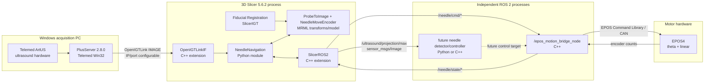

# Architecture

The Slicer Python module owns visualization, user interaction, recording, projection, and
mapping degree/mm state into the MRML transform. The bridge is a separate ROS 2 C++ process
and owns EPOS unit conversion and hardware I/O. PlusServer is a separate Windows program.

Future detection should remain an independent ROS 2 node subscribing to the image topic.
Publish detections and proposed targets separately, and place safety/limit validation between
detector output and motor commands. This preserves the current manual behavior while allowing
the detector to be introduced and tested without embedding inference load in Slicer.
