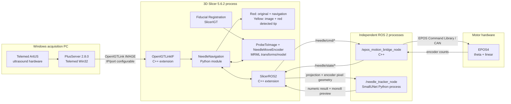

# Architecture

The Slicer Python module owns visualization, user interaction, recording, projection, and
mapping degree/mm state into the MRML transform. The bridge is a separate ROS 2 C++ process
and owns EPOS unit conversion and hardware I/O. PlusServer is a separate Windows program.

Detection remains an independent ROS 2 node so CUDA/PyTorch work cannot block the Slicer UI.
The node subscribes to images and encoder-derived pixel geometry, but publishes only detection
results and a preview. There is deliberately no detector-to-bridge motor command path. Any
future closed-loop control must be added as a separate, safety-reviewed layer with explicit
limits and watchdog behavior.

The detector computes in canonical 512×512 coordinates. Its preview is restored to the native
input dimensions, and Slicer copies the source volume's IJK-to-RAS matrix and parent transform.
Red and Yellow then share an identical SliceToRAS matrix, preventing aspect, registration, or
90-degree rotation differences.
